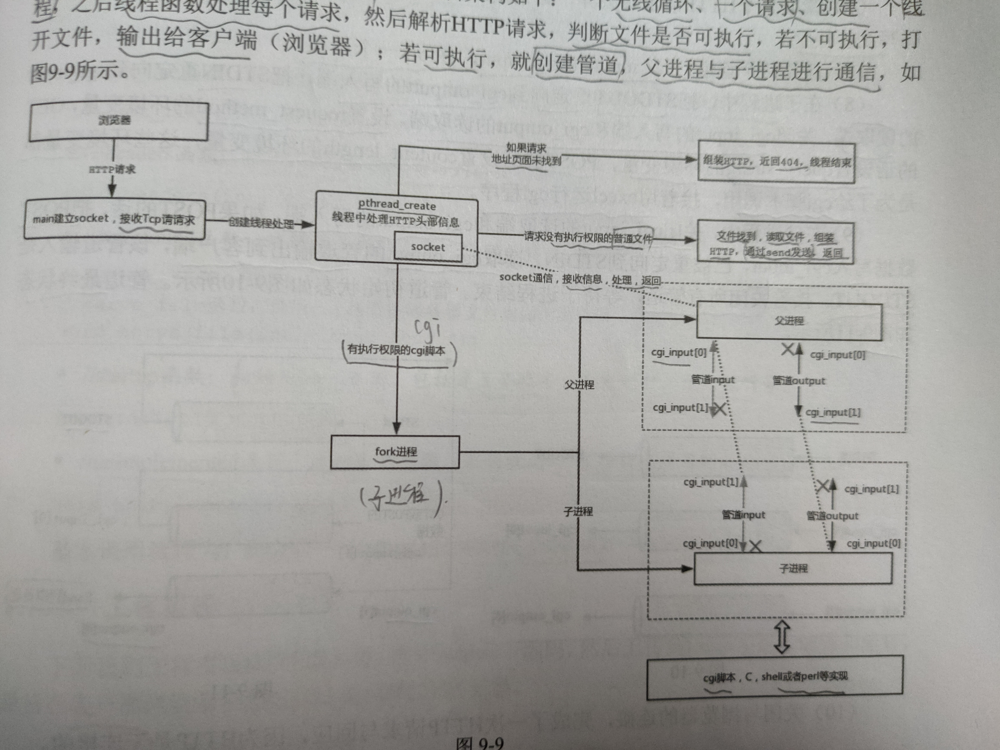
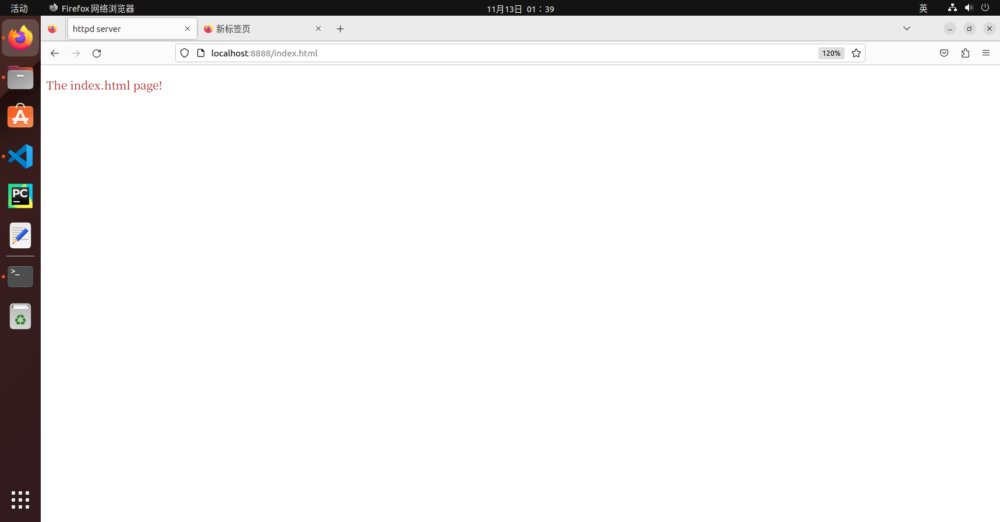
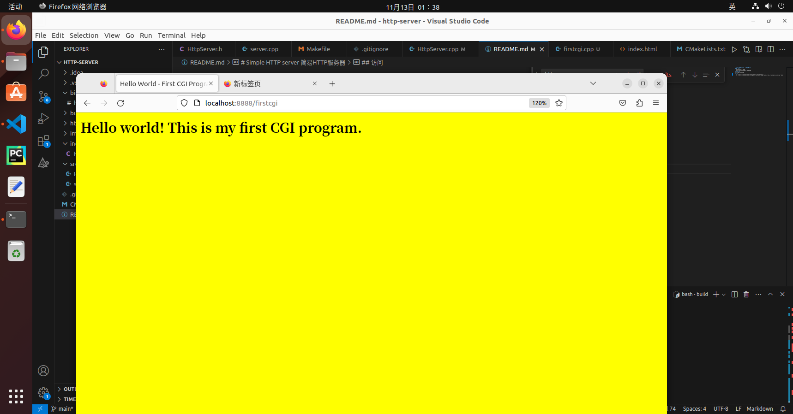

# Simple HTTP server 简易HTTP服务器
## 运行方式
- 到build目录执行 make
- 然后启动bin目录下的可执行文件即可

*注意：在HttpServer.cpp的accept_reques函数实现中可能需要修改htdocs所在的路径*
## 核心框架

## 访问
- 通过访问http://localhost:8888/index.html可以访问静态文件资源

- 通过访问http://localhost:8888/firstcgi可以访问htdocs中的cgi程序 子进程运行程序并将输出结果返回给客户端
